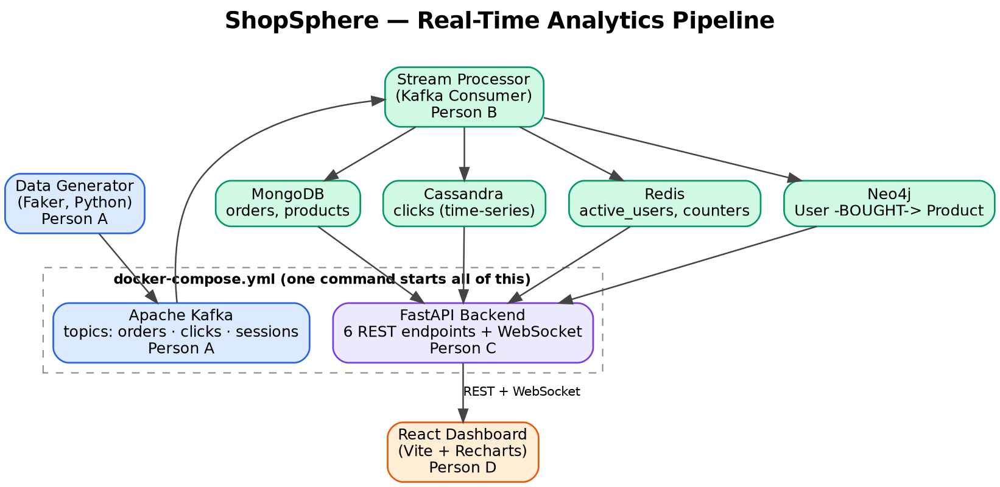

# ShopSphere: Multi-NoSQL Real-Time Business Analytics Platform

A simulated online store streams events through Kafka into **four NoSQL
databases**, each chosen for the kind of data it handles best, and a React
dashboard shows live business metrics.

This demonstrates *polyglot persistence* (using several databases for different
jobs) combined with *real-time streaming*, the way companies like Amazon and
Netflix design their systems.

## Architecture

```
Event generator → Kafka → Stream processor ─┬→ MongoDB    (orders, products)
                                            ├→ Cassandra  (click events)
                                            ├→ Redis      (live counters, sessions)
                                            └→ Neo4j      (user–product graph)
                                                     │
                                          FastAPI (REST + WebSocket)
                                                     │
                                            React dashboard
```



### Why four databases?

| Database | Stores | Why it fits |
|---|---|---|
| **MongoDB** | Orders, products | Flexible, document-shaped business entities |
| **Cassandra** | Click events | Very high write throughput, time-ordered data |
| **Redis** | Counters, sessions, active users | In-memory, sub-millisecond reads for live numbers |
| **Neo4j** | User → Product purchases | Relationships and recommendations are natural graph queries |

### Event routing

| Event | Kafka topic | Written to |
|---|---|---|
| `order` | `orders` | MongoDB, Neo4j, Redis (revenue/order counters) |
| `click` | `clicks` | Cassandra |
| `session` | `sessions` | Redis (session status, active users) |

Each database is updated independently, so the system is **eventually
consistent**: Kafka is the single source of truth, and numbers on different
dashboard panels may differ by a second or two.

## Project structure

```
Shopsphere/
├── producer/            # Person A: event generator + Kafka producer
├── stream_processor/    # Person B: Kafka consumer + 4 database writers
├── backend/             # Person C: FastAPI REST API + WebSocket
├── frontend/            # Person D: React + Recharts dashboard
├── docs/                # Event schema, API contract, architecture diagram
└── docker-compose.yml   # Kafka, Zookeeper, 4 databases, backend
```

Each stage folder contains its own handoff documentation.

## Prerequisites
- Docker Desktop (running)
- Python 3.10+
- Node.js 18+ and npm

## Run it end to end

Use a separate terminal for steps 4–6.

**1. Start the infrastructure** (from the repo root)
```bash
docker compose up -d
```
This starts Zookeeper, Kafka, MongoDB, Cassandra, Redis, Neo4j and the backend.

**2. Wait for Cassandra** (about 60–90 seconds on first start)
```bash
docker exec cassandra cqlsh -e "describe keyspaces"
```
Wait until this command succeeds. Starting the consumer earlier can fail.

**3. Seed the product catalog** (once)
```bash
cd stream_processor
pip install -r requirements.txt
python seed_products.py
```

**4. Start the stream processor**
```bash
cd stream_processor
python consumer.py
```

**5. Start the producer**
```bash
cd producer
pip install -r requirements.txt
python kafka_producer.py
```

**6. Start the dashboard**
```bash
cd frontend
npm install
npm run dev
```

**7. Open the app**
- Dashboard: http://localhost:5173
- API docs (Swagger): http://localhost:8000/docs
- Health check: http://localhost:8000/api/health
- Neo4j browser: http://localhost:7474 (user `neo4j`, password `password`)

Revenue and order numbers should increase while the producer is running.

### Stopping
Press Ctrl+C in each terminal, then:
```bash
docker compose down        # keep data
docker compose down -v     # also wipe all database data
```

### Why aren't the producer, consumer and frontend in Docker?
The infrastructure and backend run in Docker. The producer, consumer and
frontend run on the host so they are easy to start, stop and watch during a
demo. The frontend is a Vite dev server calling `localhost:8000`, so
containerizing it would add build steps with no functional benefit.

## API overview

| Endpoint | Description |
|---|---|
| `GET /api/health` | Liveness of each database |
| `GET /api/revenue` | Revenue and order totals |
| `GET /api/orders?limit=10` | Most recent orders |
| `GET /api/active-users` | Current active users |
| `GET /api/top-products?limit=5` | Best-selling products |
| `GET /api/click-activity` | Click counts per page |
| `GET /api/user-activity?product_id=P14` | Approximate site activity |
| `GET /api/recommendations?product_id=P14` | "Bought together" from Neo4j |
| `WS /ws/live-updates` | Live push of snapshots and new-order events |

Full request and response formats: [`docs/api-contract.md`](docs/api-contract.md).

## Troubleshooting

| Symptom | Likely cause and fix |
|---|---|
| Consumer crashes on startup | Cassandra not ready yet. Wait and retry (step 2). |
| Dashboard shows zeros | Producer or consumer isn't running. Check their terminals. |
| Product IDs instead of names | `seed_products.py` wasn't run (step 3). |
| Live panel stuck on "Waiting..." | Backend restarted. Refresh the page (no auto-reconnect). |
| CORS errors in the browser | Vite isn't on port 5173. Free the port or update `CORS_ORIGINS` in `docker-compose.yml`. |
| `/api/health` reports a database down | `docker compose ps` and check that container's logs. |

## Team and contributions

| Person | Stage | Folder |
|---|---|---|
| NIMRAH N| Data generation and Kafka | `producer/` |
| SAKSHI S NAIK | Stream processing and 4 NoSQL databases | `stream_processor/` |
| DISHA G | FastAPI backend and WebSocket | `backend/` |
| DHARSHAN | React dashboard and Docker Compose | `frontend/`, `docker-compose.yml` |

The project followed a **handoff pipeline model**: each person built on the real,
tested output of the previous stage, with a `HANDOFF.md` documenting every
transition.

## Documentation
- [`docs/event-schema.md`](docs/event-schema.md): event formats
- [`docs/api-contract.md`](docs/api-contract.md): API endpoints and WebSocket messages
- [`docs/architecture-diagram.png`](docs/architecture-diagram.png): architecture diagram
- Handoff docs in `producer/`, `stream_processor/`, `backend/` and `frontend/`

## Known limitations and future work
- Clicks carry a page category but no `product_id`, so per-product click counts aren't possible.
- The dashboard WebSocket doesn't auto-reconnect.
- The frontend, producer and consumer aren't containerized.
- Product catalog is limited to 10 seeded products (`P10`–`P19`).
